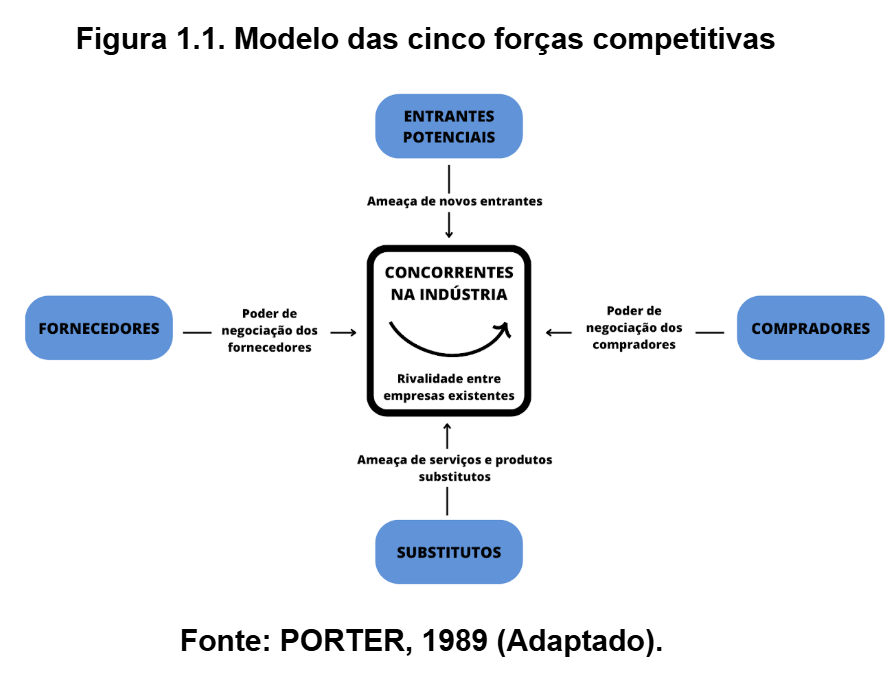
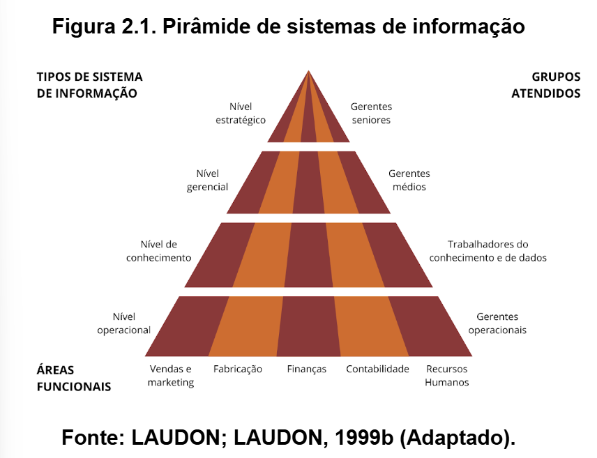

# SISTEMAS INTEGRADOS DE GESTÃO (SIG)

Este local inclui todos os pontos relevantes desse assunto, desde conceitos e fundamentos do SIG.

---

Um SIG (Sistema Integrado de Gestão) é um software que conecta todos os setores de uma empresa, facilitando o compartilhamento de informações e melhorando a organização, a agilidade e a tomada de decisões.
Um SIG pode ser composto por diversos módulos integrados entre si, possuindo um Banco de Dados central.

---
## Vantagens do SIG
Os Sistemas Integrados de Gestão apresentam diversas características, entre as quais podem ser citadas (TURBAN et al, 2007, LAUDON, LAUDON, 1999a, 1999b):

a) Reúnem os processos de negócios essenciais da empresa em um único SI;

b) Permitem que a informação flua livremente para toda a organização, melhorando a coordenação, a eficiência e a tomada de decisão;

c) Geralmente são constituídos por um conjunto de módulos de software integrado e um SGBD – Sistema Gerenciador de Banco de Dados central comum, que coleta e disponibiliza dados;

d) Podem atuar em praticamente todas as atividades internas de uma organização;

e) Ampla disponibilidade dos dados para todos os processos organizacionais;

f) Podem acarretar significativas mudanças nos processos organizacionais;

g) Influenciam no modelo e estrutura organizacional.

Os SIGs representam um importante fator para apoiar o planejamento estratégico de uma organização, e representa um fator de apoio para a obtenção de uma vantagem competitiva sobre a concorrência. Podem também permitir respostas mais rápidas às mudanças competitivas ambientais.

---

## SISTEMA DE INFORMAÇÃO ESTRÁTEGICO (SIE)

O SIE pode ser entendido como aquele que sistema de informação que possibilitam a mudança das metas organizacionais, as suas operações e serviços que entregam ao mercado e os relacionamentos ambientais das organizações, ajudando a manter a vantagem competitiva sobre a concorrência.

### Características do SIE

a) Podem mudar o negócio da empresa;

b) Podem ser utilizados em qualquer ponto da organização;

c) Podem alterar profundamente o modo como as firmas conduzem os seus negócios ou mesmo o próprio negócio da empresa.

d) Podem integrar e sintetizar dados obtidos a partir de fontes internas e externas à organização, utilizando ferramentas de análise e comparação complexas, simulação e outras facilidades para a tomada de decisão da cúpula estratégica da organização.

As organizações buscam desenvolver usos particulares da Informação e de seus Sistemas de Informação que possam representar um diferencial competitivo. O Modelo das Cinco Forças Competitivas de Porter (PORTER, 1989) apresenta um conjunto de forças cujo combinação permitiria que uma organização avaliasse a sua capacidade competitiva dentro do segmento em que atua, conforme exposto na Figura 1.1.

---

---

| Força de Porter     | Como a TI pode ajudar?                      |
| ------------------- | ------------------------------------------- |
| Concorrência direta | Inovação, automação, análise de dados       |
| Novos entrantes     | Criar barreiras tecnológicas                |
| Fornecedores        | Negociação via sistemas inteligentes        |
| Clientes            | Personalização e fidelização com tecnologia |
| Substitutos         | Inovação contínua e adaptação               |

vantagem competitiva é resultado da combinação das cinco forças competitivas, a saber: a) ameaça de novos concorrentes (novos entrantes); b) ameaça de novos produtos ou serviços (substitutos); c) rivalidade entre as empresas concorrentes; c) poder de barganha dos clientes e, e) poder de barganha dos fornecedores.

## 3 Estratégias Competitivas de Porter (1989)

### Baixo Custo
→ A empresa vende mais barato que os concorrentes, mantendo qualidade aceitável, porque tem custos de produção menores.

Liderança em Baixo Custo ou produtos de Baixo Custo, podem ser observados os seguintes fatores:

• TI ajuda a reduzir custos: A tecnologia da informação pode ajudar a empresa a gastar menos para funcionar e vender produtos com preços mais baixos.

• Produção e atendimento maiores sem aumentar custos: Com TI, as empresas podem produzir e atender mais clientes sem gastar muito a mais.

• Gestão compartilhada de estoque: Grandes lojas estão trabalhando junto com seus fornecedores para controlar melhor o estoque.

• Reposição diária pelos fornecedores: Os fornecedores entregam produtos todo dia, assim a loja precisa guardar menos mercadoria, economizando espaço e evitando perdas.

### Diferenciação
→ A empresa oferece algo único ou especial que faz o cliente pagar mais caro (ex: marca, design, inovação).

Sobre a diferenciação de produtos pode-se observar:

• A TI tem sido utilizada para facilitar a criação de novos e diferenciados produtos e serviços em todos os setores econômicos;

• A TI tem o caráter de tornar mais conveniente o uso de produtos e serviços que sejam significativos e criem valor para o cliente, como os app financeiros;

• A TI permite, cada vez mais, a criação de serviços e produtos que se ajustem a especificações precisas de clientes individuais;

• A TI permite a customização em massa cada vez mais individualizada.

### Foco
→ A empresa atende um público ou nicho específico, usando baixo custo ou diferenciação, mas focando em um segmento restrito.

TI ajuda a focar em um público específico:

• A tecnologia pode ser usada para atender um grupo de clientes bem definido melhor do que os concorrentes.

• Sistemas de Informação (como os SIGs) analisam clientes:
Eles ajudam a entender o que os clientes gostam, compram e preferem, para a empresa fazer ofertas mais certeiras.

• TI ajuda a vender mais para os mesmos clientes:
Com sistemas integrados, dá pra oferecer novos produtos e serviços para quem já é cliente, sem gastar muito para conquistar outros.

---

## FLUXO DE INFORMAÇÃO NAS ORGANIZAÇÕES

### Introdução

O modelo mais conhecido é o de Laudon e Laudon e Turban et al que apresentam os nivéis hierárquico organizados através de um modelo de pirâmide, evidenciando os S.I (Sistemas de Informação) mais relevantes.

Na figura tabela (LAUDON; LAUDON, 1999b), estão presentes diversos exemplos de Sistemas de Informação. Neste caso, estão representados uma ampla variedade de tipos de S.I.s que são habitualmente presentes nas organizações modernas, principalmente grandes empresas. Deve-se observar que os S.I. são categorizados de acordo com a utilização que eles possuem dentro das empresas, embora possam variar entre as empresas de segmentos diferentes.

---

| **Nível Hierárquico**                     | **Tipo de Sistema**                                                                              | **Exemplos (por área da empresa)**                                                                                                                                                                                                                                                                                                                            |
| ----------------------------------------- | ------------------------------------------------------------------------------------------------ | ------------------------------------------------------------------------------------------------------------------------------------------------------------------------------------------------------------------------------------------------------------------------------------------------------------------------------------------------------------- |
| **Estratégico (Alta Direção)**            | **Sistemas de Apoio Executivo (SAEs)**                                                           | - Previsão quinquenal da tendência de vendas - Plano operacional quinquenal - Previsão quinquenal de orçamento - Planejamento de lucros - Planejamento de pessoal                                                                                                                                                                                 |
| **Gerencial (Média Gerência)**            | **Sistemas de Informações Gerenciais (SIGs)** **Sistemas de Apoio à Decisão (SADs)**          | - Gerenciamento de vendas - Controle de estoque - Orçamento anual - Análise de investimento de recursos - Análise de preços e lucratividade - Análise de realocação - Programação da produção - Análise de custo - Análise de custo de contratos - Análise das vendas por região                                                   |
| **Conhecimento (Profissionais Técnicos)** | **Sistemas dos Trabalhadores do Conhecimento (STCs)** **Sistemas de Automação de Escritório** | - Estações de trabalho de engenharia - Estações gráficas - Estações administrativas - Edição de texto - Digitalização de documentos - Tratamento de imagens - Agendas eletrônicas                                                                                                                                                           |
| **Operacional (Nível de Execução)**       | **Sistemas de Processamento de Transações (SPTs)**                                               | - Processamento e acompanhamento de pedidos - Controle de movimentação de materiais - Controle de maquinário - Programação industrial - Negociação de seguros - Gerenciamento de caixa - Contas a pagar e a receber - Folha de pagamento - Remuneração - Treinamento e desenvolvimento - Manutenção do registro de funcionários |

---

### 1. Nível Estratégico (Topo da pirâmide)

🔧 Ferramentas usadas: SAEs (Sistemas de Apoio Executivo)

👤 Quem usa: Diretores, Presidentes, Alta administração

🎯 Foco: Visão de futuro, decisões de longo prazo

📈 Exemplo:
• Planejar quantos funcionários a empresa precisará em 5 anos

• Decidir se vale a pena abrir uma nova filial

Esses sistemas oferecem gráficos, dashboards, relatórios consolidados, baseados em dados vindos dos outros níveis.

### 2. Nível Gerencial (Meio da pirâmide)

🔧 Ferramentas usadas: SIGs e SADs

👤 Quem usa: Gerentes, coordenadores, analistas

🎯 Foco: Tomar decisões táticas (mensais, trimestrais, anuais)

📊 Exemplo:
• Comparar o desempenho de vendas por região

• Verificar o custo-benefício de uma campanha de marketing

• Programar a produção de acordo com a demanda

SADs ajudam na análise e decisão, enquanto SIGs organizam e mostram os dados operacionais.

### 3. Nível do Conhecimento (Apoio Técnico e Intelectual)

🔧 Ferramentas usadas: STCs + Automação de Escritório

👤 Quem usa: Engenheiros, Designers, Arquitetos, Analistas

🎯 Foco: Criatividade, produtividade e qualidade do conhecimento

💡 Exemplo:
• Estações gráficas para criação de projetos

• Edição e digitalização de documentos

• Agendas e e-mails corporativos

É a base que sustenta o fluxo de conhecimento e documentação da empresa.

---

## Sistemas de informações transacionais

Tabela Sistemas de Informação Transacionais (STP ou SIT) com foco no que realmente importa:

|                                              |                                                          |
| --------------------------------------------------------------------- | ------------------------------------------------------------------------------------------------------- |
| STP registra **transações rotineiras** (vendas, compras, pagamentos). | Você entende que esse sistema opera **no nível operacional**, na base da pirâmide da empresa.           |
| STP é **OLTP** (Online Transaction Processing).                       | Mostra que os dados são processados **em tempo real** e refletem o estado **atual da empresa**.         |
| É usado para **captar, processar e atualizar** dados do negócio.      | Isso mostra que ele **alimenta os outros sistemas** com dados confiáveis e atuais.                      |
| Dados precisam ser processados com **velocidade e precisão**.         | Você entende que é vital para atender bem o cliente e **evitar erros** ou fraudes.                      |
| STP é a **base dos Sistemas Integrados de Gestão (ERP)**.             | Tudo começa com o STP: ele **gera os dados** que os SIGs, SADs e SAEs vão usar para análise e decisões. |

### Objetivos do STP:

P.R.O.C.E.S.S.O. (sigla mnemônica para STP):

1. Processamento rápido (OLTP)

2. Registra transações

3. Operacional (nível mais baixo)

4. Confiável e preciso

5. Evita fraudes

6. Serve de base para outros sistemas(SIG, SAD, SAE)

7. Suporte ao atendimento ao cliente

8. Obtem vantagem competitiva

---

## Sistemas de Automação de Escritório (SAE)
- **Função:** Automatizar tarefas administrativas
- **Exemplo:** Microsoft Office (Word, Excel, Outlook, etc.)
- **Área:** Setor administrativo
- **Benefícios:**
  - Reduz trabalho manual
  - Organiza documentos e agendas
  - Aumenta produtividade
 
## Sistemas Especialistas (SE)
- **Função:** Simular decisões de especialistas humanos
- **Base:** Inteligência artificial e banco de regras
- **Usos:** Diagnóstico médico, suporte técnico, engenharia
- **Benefícios:**
  - Preserva conhecimento de especialistas
  - Auxilia iniciantes
  - Dá suporte à tomada de decisão técnica
 
| Característica   | **Sistema de Automação de Escritório (SAE)** | **Sistema Especialista (SE)**                       |
| ---------------- | -------------------------------------------- | --------------------------------------------------- |
| Área de atuação  | Escritório, setor administrativo             | Técnica, especializada (medicina, engenharia etc.)  |
| Finalidade       | Reduzir esforço manual e rotinas repetitivas | Apoiar a decisão com base em conhecimento técnico   |
| Exemplo          | Word, Excel, Outlook, PowerPoint             | Diagnóstico médico por IA, sistemas de recomendação |
| Quem usa         | Funcionários em geral                        | Profissionais técnicos ou operadores iniciantes     |
| Base tecnológica | Softwares de produtividade pessoal           | Inteligência artificial + base de conhecimento      |

---

## Sistemas de Informações Gerenciais (SIG / MIS)

> SIG (ou MIS - Management Information Systems) são sistemas voltados ao suporte gerencial, especialmente para gestores de **nível tático**. São usados para facilitar a **tomada de decisões**, com dados integrados, consolidados e atualizados.

### Objetivos do SIG

- Apoiar decisões táticas (planejamento e controle)
- Consolidação de dados de diversos setores
- Visualização de desempenho organizacional
- Agilidade na análise de informações

## Características Principais

| Característica                         | Descrição                                                                 |
|---------------------------------------|--------------------------------------------------------------------------|
| 🎯 Foco                               | Nível tático (gerentes)                                                  |
| 📊 Integração                         | Reúne dados de diversos setores                                          |
| ⏱️ Atualização                        | Quase em tempo real                                                      |
| 📈 Visualização                       | Dashboards com múltiplas visões (diária, mensal, etc.)                   |
| 💾 Base de dados única                | Facilita manutenção e análise de grandes volumes                         |
| 🧩 Suporte à decisão semi-estruturada | Auxilia decisões que precisam de dados e julgamento humano               |

### Papel nas Organizações

- Acompanhamento de metas e indicadores de desempenho
- Suporte ao planejamento estratégico
- Integração entre áreas da empresa
- Centralização e padronização das informações

  ---

## Sistemas de Apoio à Decisão (SAD)

> **Baseado em:** Turban et al (2011), Stair & Reynolds (2012)

### O que é um SAD?

Sistemas de Apoio à Decisão (SAD) são ferramentas que auxiliam gestores a tomar decisões baseadas em dados, reduzindo a dependência de julgamentos pessoais ou intuições.

Segundo Turban et al (2011), o objetivo principal de um SAD é **reduzir o gap entre a performance real e a performance desejada das organizações**, contribuindo diretamente para a estratégia empresarial.

---

### SAD e Gestão

A gestão é o processo de alcançar objetivos organizacionais utilizando os recursos disponíveis. Esses recursos são considerados **entradas (inputs)** e os resultados gerados são as **saídas (outputs)**. A eficiência da gestão pode ser avaliada pela razão entre saídas e entradas — ou seja, pela produtividade.

A tomada de decisão é central nesse processo, e os SADs apoiam exatamente esse ponto, permitindo que o gestor escolha a melhor alternativa entre várias opções.

---

### Benefícios e Capacidades dos SADs

Os SADs oferecem suporte de várias formas:

-  **Velocidade de processamento**
-  **Melhoria na comunicação e colaboração**
-  **Maior produtividade em grupo**
-  **Apoio à superação dos limites cognitivos humanos**
-  **Gestão de grandes volumes de dados**
-  **Integração com data warehouses**
-  **Disponibilidade via Web (acesso remoto)**
-  **Uso de dashboards altamente visuais e customizáveis**
-  **Alto nível de sigilo nas informações**
-  **Suporte ágil à tomada de decisão**

---

### Usuários-alvo

Os SADs são voltados principalmente para **gestores estratégicos e executivos**, oferecendo informações consolidadas e visuais para apoiar decisões de alto impacto.

Essas informações são altamente sigilosas e, muitas vezes, refletem dados operacionais em tempo real, permitindo ações rápidas e bem embasadas.

---

# SOLUÇÕES INTEGRADAS DE TI: BUSINESS INTELLIGENCE

---

## Conceitos gerais

Muitos dados das empresas são gerados nas transações de negócios. Outra parte de dados pode ser obtida de fontes externas, sendo que tambem existem aqueles dados obtidos durante toda a existência da organização. Esses dados no caso de grandes empresas, geralmente são organizados em repositórios denominados Data Warehouse e Data Mart. Para lidar com grandes volumes de dados, as organizações utilizam ferramentas que permitem analisar, consolidar e acessar essas informações. O objetivo é identificar padrões, relacionamentos e gerar insights que apoiem a tomada de decisões estratégicas e mais assertivas nos negócios compreendem os Sistemas do tipo Business Intelligence como sendo as aplicações e tecnologias destinadas à consolidação, a análise e fornecimento de acessos a volumes muito grandes de dados para auxiliarem os usuários a tomarem melhores decisões estratégicas e de negócios.

---

## O processo de tomada de decisão

Com o avanço das TICs (Tecnologias de Informação e Comunicação) e a popularização da Internet, o processo de decisão nas empresas se tornou mais complexo. Antes, a falta de informação era o problema; hoje, é o excesso de dados. Isso exige ferramentas capazes de coletar, limpar, armazenar e processar grandes volumes de dados, garantindo confiabilidade e agilidade nas decisões. A adaptação dos processos e das tecnologias tornou-se essencial para manter a competitividade no cenário atual.

---

## Hierarquia das Decisões

As decisões nas organizações podem ser classificadas quanto à **programação**, **estruturação** e **grau de incerteza**.

### 1. Quanto à Programação
- **Programadas**: Baseadas em regras, procedimentos ou métodos quantitativos. Fáceis de resolver.
- **Não Programadas**: Situações inesperadas, incomuns e de difícil quantificação.

### 2. Quanto à Estruturação
### a) Decisões Estruturadas
- Características: Rotineiras, repetitivas, de baixa complexidade.
- Nível: Operacional (curto prazo).
- Exemplos: Oferta de crédito, reposição de estoque, autorização de horas extras.
- Sistemas de apoio: **MIS** (Management Information Systems).
- Grau de incerteza: **Baixo**.

### b) Decisões Não Estruturadas
- Características: Novas, inusitadas, importantes, não rotineiras.
- Nível: Estratégico (longo prazo).
- Exemplos: Entrada/saída de mercados, aprovação de orçamento, definição de metas de longo prazo.
- Sistemas de apoio: **EIS** (Executive Information Systems).
- Grau de incerteza: **Alto**.

### c) Decisões Semiestruturadas
- Características: Combinação de aspectos estruturados e não estruturados.
- Nível: Tático (médio prazo).
- Exemplos: Plano de marketing, orçamento departamental, criação de novo site corporativo.
- Sistemas de apoio: **MIS** e **DSS** (Decision Support Systems).
- Grau de incerteza: **Médio**.

---

## Arquitetura de um BI

Um Sistema de Inteligência de Negócios (BI) é formado por quatro componentes principais:

1. Data Warehouse – grande banco de dados que armazena as informações da empresa.

2. Business Analytics – ferramentas para manipulação, mineração e análise de dados.

3. Business Performance Management (BPM) – gestão do desempenho, monitorando indicadores e resultados.

4. User Interface – interface visual (como dashboards) que apresenta gráficos e tabelas com indicadores-chave.

Ferramentas comuns incluem: consultas e relatórios, análise multidimensional (OLAP) e data mining.

- **Data Mart: versão reduzida e específica do Data Warehouse, focada em um departamento.**

- **Data Mining: processo de descobrir padrões, tendências e comportamentos a partir de grandes volumes de dados.**

Principais usos do data mining:

1. Prever tendências e comportamentos.

2. Identificar padrões desconhecidos.

---

## O processo de BI

O processo de Business Intelligence (BI) começa com a coleta de dados de diversas fontes, internas ou externas à organização (operacionais, de clientes, manufatura e históricos).
Esses dados são armazenados em Data Warehouse ou Data Mart e, em seguida, manipulados e analisados com ferramentas de mineração e análise para encontrar padrões e significados.
Os resultados são apresentados em dashboards, permitindo que gestores tomem decisões mais assertivas.

1. **Pré-requisitos para um processo de BI eficaz:**

2. **Disponibilidade de dados transacionais (histórico de interações com clientes).**

3. **Saneamento de dados (limpeza e padronização).**

4. **Acesso rápido aos dados.**

Definição clara do que será extraído dos dados.

O objetivo final do BI é transformar dados em informação, informação em decisão, e decisão em ação.

---

## Benefícios do BI

O principal benefício do Business Intelligence (BI) é a capacidade de fornecer informações precisas no momento certo, incluindo visão em tempo real da performance da empresa.
Essas informações apoiam todos os tipos de decisões, planejamento estratégico e até a sobrevivência organizacional.

1. Principais benefícios do BI:

2. Relatórios mais rápidos e precisos.

3. Melhor qualidade nas decisões (mais assertivas).

4. Melhoria no atendimento ao cliente.

5. Aumento da receita.

6. Aumento da produtividade.

7. Melhor compreensão das tendências de mercado.

8. Maior agilidade para responder a mudanças no mercado.

Parte desses benefícios é intangível, sendo percebida ao longo do tempo conforme a organização amadurece no uso do BI.

## Níveis e tipos de sistemas 

| **Nível Organizacional** | **Foco Principal**                                                  | **Exemplo de Sistema**                            | **Relação com BI**                                                         |
| ------------------------ | ------------------------------------------------------------------- | ------------------------------------------------- | -------------------------------------------------------------------------- |
| **Operacional**          | Execução de tarefas do dia a dia, registro de transações            | **TPS** – Sistemas de Processamento de Transações | BI não atua diretamente aqui, mas usa dados desse nível como matéria-prima |
| **Tático (Gerencial)**   | Acompanhamento e controle de áreas/setores, relatórios consolidados | **MIS** – Sistemas de Informação Gerencial        | BI atua fortemente aqui para apoiar supervisores e gerentes                |
| **Estratégico**          | Decisões de longo prazo, visão global e futura da empresa           | **EIS / SAE** – Sistema de Apoio ao Executivo     | BI atua aqui com visão consolidada e indicadores estratégicos              |

---

# SOLUÇÕES INTEGRADAS DE TI: Customer Relationship Management (CRM)

---

## INTRODUÇÃO

O aumento da competividade entre as organizações foi amplamente deciminada por meio da Tecnologia da Informação e Comunicação. Por sua vez essa também trouxe a adoção de Sistemas de Gestão de Relacionamento com o Cliente (CRM) adquiriu maior relevância dentro das estratégias organizacionais.

---

## CONCEITOS GERAIS

A preocupação com o cliente sempre foi uma reaalidade organizacional. Entretanto foi com o advento da TI que os Sistemas de informação do tipo CRM se tornassem mais críticos para o sucesso dos negócios atuais.
Rainer e Cegielski (2011, p.307) afirmam que um CRM representa uma estratégia organizacional focada e dirigida para o cliente, no qual a organização se concentra em satisfazer os clientes, avaliando suas solicitações por produtos e serviços, para então fornecer-lhes serviços responsivos e de alta qualidade.
o relacionamento com o cliente representa um dos ativos mais valiosos para as empresas.

---

##  O SISTEMA DE GESTÃO DO RELACIONAMENTO COM O CLIENTE (CRM)

Atualmente, as empresas precisam de sistemas automatizados para **monitorar clientes** e usam o **marketing** para **construir relações de longo prazo** com eles.
Dessa forma, definem a administração de marketing (KOTLER; KELLER, 2012, p. 3) como “[...] a arte e a ciência de selecionar mercados-alvo e captar, manter e fidelizar clientes por meio da criação, entrega e comunicação de um valor superior para o cliente.”. 
justamente para melhorarem a captação, manutenção e fidelização de clientes, as empresas passaram a adotar os Sistemas CRM. Entre as justificativas elencadas, citam-se Laudon e Laudon (2011, p.285-288) e Rainer e Cegielski  (2011, p.306-308):

a) Consolidação das informações existentes dos clientes na empresa;

b) Aumento da concorrência;

c) Melhora no atendimento ao cliente, buscando criar diferenciação competitiva;

d) Identificação dos clientes lucrativos e não lucrativos das organizações;

e) Identificação das oportunidades de venda cruzada de produtos e serviços;

f) Necessidade de diferenciação de produtos, cada vez mais massificados.

Adicionalmente, as empresas enfrentam dificuldades em entender as motivações de compra e os motivos de abandono dos clientes, além de lidar com fatores legais, como o Código de Defesa do Consumidor.

---

## ÁREAS DE APLICAÇÃO DO CRM

O CRM ajuda as empresas em marketing, vendas e serviços ao cliente. No marketing, permite gerenciar campanhas em vários canais, qualificar leads e rastrear ações. Nos serviços, aumenta a eficiência de call centers e help desks, incluindo autoatendimento online. Nas vendas, auxilia na produtividade da equipe, focando em clientes mais lucrativos e fornecendo informações de contato, produtos e cotações.

---

## DIMENSÕES DO CRM

O CRM possui diferentes dimensões, destacando-se:

CRM Analítico:

- Analisa dados gerados pelo CRM Operacional para melhorar a performance.

- Baseia-se em data warehouses, mineração de dados e técnicas de análise.

- Avalia comportamento e percepções do cliente, criando modelos estatísticos de aquisição, retenção e perda.

- Fornece inteligência de negócios para identificar tendências de mercado e apoiar decisões estratégicas.

CRM Operacional:

- Suporta processos de linha de frente como vendas, marketing e serviços.

- Inclui sistemas de atendimento ao cliente (SAC), Sales Force Automation (SFA), automação de marketing e gestão de campanhas.

- Oferece recursos de contato direto com clientes: pesquisas, comparações, informações técnicas, serviços customizados, FAQs, e-mail automático e programas de fidelidade.

CRM Colaborativo:

- Foca na integração de todos os pontos de contato do cliente com a empresa.

- Compartilha informações entre equipes e parceiros da cadeia de suprimentos, melhorando a comunicação e a tomada de decisão.

CRM Social:

- Estratégia baseada em interações online e offline.

- Coleta informações de redes sociais para entender perfil, preferências e sentimentos dos clientes, ampliando o conhecimento do mercado e auxiliando decisões estratégicas.

Resumo geral: O CRM combina análise de dados, automação operacional e integração colaborativa/social para melhorar o relacionamento com clientes, otimizar processos e apoiar decisões estratégicas.

---

## FATORES CRÍTICOS DE SUCESSO DO CRM

Um FCS é uma área essencial cujo bom desempenho garante o sucesso competitivo da empresa e a efetiva implementação de uma estratégia de CRM. Eles envolvem pessoas, tecnologia e processos:

1️⃣ Pessoas

- Suporte dos altos executivos e do CEO

- Cultura organizacional

- Gestão de recursos humanos e do conhecimento

- Estratégia do CRM

- Integração entre equipes

- Orientação ao cliente

- Empregados experientes e qualificados

2️⃣ Tecnologia

- Infraestrutura organizacional

- Gestão do conhecimento

- Qualidade da informação e do sistema

- Qualidade dos serviços

- Orientação ao cliente

- Prontidão tecnológica

3️⃣ Processos

- Cultura organizacional

- Gestão de recursos humanos

- Estratégia e processos de CRM

- Qualidade do serviço

- Integração

- Orientação ao cliente

---

## PROBLEMAS DE IMPLATAÇÃO DO CRM

Principais dificuldades que podem afetar a implantação (Farhan, Abed e Ellatif, 2018):

- Falta de apoio da **alta administração** e **visão estratégica** clara
- **Gestão de mudanças** inadequada e cultura organizacional desfavorável
- Recursos humanos **com baixa habilidade** e programas de **treinamento ruins**
- Falhas na **reengenharia de processos** e foco excessivo apenas na tecnologia
- **Custo inicial** elevado e planejamento insuficiente
- Dificuldades na **mineração de dados e integração** de sistemas
- Falta de alinhamento do CRM à **estratégia da organização**
- Problemas de **segurança, avaliação, envolvimento da equipe**
- **Dados insuficientes ou de baixa qualidade**
- Falta de foco no **retorno sobre investimento** e na **quantificação do valor do cliente**

---

## Benefícios do CRM
Principais vantagens do uso do CRM (Laudon & Laudon, 2011; Rainer & Cegielski, 2011):

- **Aumento da satisfação** dos clientes
- **Redução de custos** de marketing direto
- Marketing **mais efetivo**
- Redução do **custo de aquisição e retenção** de clientes
- **Criação de valor** para clientes e empresas
- Redução da **rotatividade de clientes**, com vendas, serviços e marketing mais alinhados às necessidades

  ---

# Enterprise Resource Planning (ERP)

---

## INTRODUÇÃO

O advento e a disseminação do uso de Sistemas de Planejamento de Recursos Empresariais trouxe maior capacidade competitiva. Ademais, possibilitou um maior alinhamento entre estrátegia organizacional e as atividades associadas à Tecnologia da informação.
A evolução dos sistemas de informação de apoio à gestão, voltados para o planejamento de recursos, pode ser compreendida em etapas básicas, conforme Ociepa-Kubicka (2017):
Sistemas de controle de estoque;

1. Planejamento de Requisitos de Material (MRP);

2. Sistemas de Planejamento de Recursos de Manufatura (MRP II);

3. Sistemas de Planejamento de Recursos Empresariais (ERP);

4. Enterprise Resource Planning (ERP II) permitindo a interconexão da empresa.

---

## SISTEMAS DE PLANEJAMENTO DE RECURSOS EMPRESARIAIS

- O SI do tipo ERP amplia a capacidadde dos tomadores de decisões
- Utilizados para integrar os processos de negócios dentro das diversas áreas organizacionais, como manufatura, produção, finanças, contabilidade, vendas, marketing e recursos humanos, dentro um **único software integrado**.
- **Único Repósitorio Integrado** disponíveis para todos os demais SIs existentes na empresa.

---

## SISTEMA DE PLANEJAMENTO DE RECURSOS ORGANIZACIONAIS

Pelo fato dos tomadores de decisões estarem sobre pressão, acabam sacrificando a qualidade da decisão por precisarem tomar decisões rápidas.
Com a era digital os tomadores de decisão não estão aproveitando ao máximo o que esta disponível. Isso se deve pela: a) incapacidade de reunirem informações suficientes; b) dificuldade em compartilhar tais informações, o que faz com que não consigam escolher as pessoas certas para o pocesso de decisão.

Decorente disso tais fatores - que prejudicam a eficiência dos processos - foram identificados:

1. Mais decisões estão sendo tomadas em menos tempo;
2. Os tomadores de decisão estão perdendo oportunidades;
3. Os tomadores de decisão estão sentindo que estão perdendo a corrida;
4. Muitas barreiras são humanas;
5. As fontes de informações estão mudando constantemente;
6. A amnésia de tomada de decisões está desenfreada.

Deve-se observar que a implementação de um Sistema ERP envolve inúmeros desafios, não apenas técnicos e financeiros, mas também culturais e de gestão organizacional.

---

## BENEFÍCIOS DOS SIS DO TIPO ERP

Cada decisão empresarial possuem caracteristicas distintas. Os tipos de SItendem a apresentar caracteristicas particulares, no caso da implementação de um SI do tipo ERP Ociepa-Kubicka (2017) argumenta que a base para a implementação sem problemas é o engajamento dos funcionários. Ademis, a abordagem gerencial moderna, familiarizando-se rapidamente com o software e utilizando-o efetivamente no cotidiano das operações da empresa. Contudo, o mesmo argumenta que a maior dificuldade no uso de um SI do tipo ERP é o financeiro, principalmente entre medias e pequenas empresas.

Entre os benefícios que podem ser obtidos com o ERP podem ser citados:

- Melhoria nos processos de trabalho; 

- Melhoria na gestão de pedidos;

- Redução de custos;

- Melhoria do atendimento ao cliente;

- Integração de informações entre os departamentos da empresa;

- Melhoria na eficiência dos processos de aquisição;

- Melhoria dos processos de distribuição ou produção;

- Melhoria da situação econômica e financeira;

- Melhoria das habilidades da equipe;

- Maior segurança de dados;

- Modernização da infraestrutura da tecnologia;

- Acesso aperfeiçoado aos dados para a tomada de decisão;

- Eliminação de sistemas ineficientes ou obsoletos;

---

## DESVANTAGENS DO SI DO TIPO ERP

- Elevado custo de aquisição e adequação às empresas;

- Necessidade de treinamento para os envolvidos com o seu uso;

- Complexidade na escolha de um ERP mais adequado à empresa;

- Complexidade na implantação;

- Dependência da empresa ao fornecedor do SI ERP escolhido, dificultando uma troca futura possível;

- Revisão e/ou adequação dos processos organizacionais;

- Tempo necessário para a implantação do ERP na organização;

- Risco de falha na implantação.

---

## O SISTEMA ERP

O Sistema ERP pode tornar mais eficiente a gestão dos processos organizacionais, melhorando os resultados organizacionais, embora exija um certo tempo para o amadurecimento e plena utilização dos recursos disponibilizados pela nova tecnologia de sistemas integrados de gestão. O sucesso da implantação de um SI ERP depende da combinação de vários fatores, que afetam em maior ou menor grau, os resultados que podem ser obtidos, que são os chamados Fatores Críticos de Sucesso (FCS).

---
